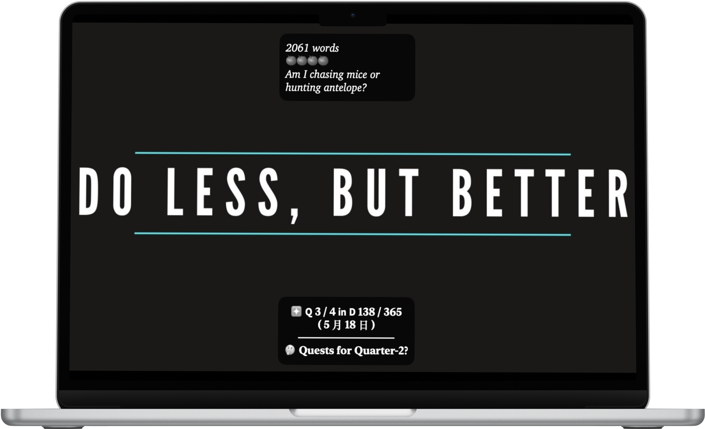

# Deep Work Machine

> **Last Update:** 2025-05-05  

<a href="">
<kbd>

</kbd>
</a>

|         | All Time | Monthly Average | Weekly Average | Daily Average |
| :---: | :---: | :---: | :---: | :---: |
| **Number of Flows** | 🍅 × 637 ≈ 21,021 minutes ≈ 350 hours | 🍅 × 127 ≈ 4,204 minutes ≈ 70 hours | 🍅 × 30 ≈ 974 minutes ≈ 16 hours | 🍅 × 4.2 ≈ 139 minutes ≈ 2.3 hours |
| **Number of Words** | 177,805 words | 35,561 words | 4,367 words | 624 words |

## About

binaural beats

## Stats

### Last Month

|  |  |
| :-: | :-: |

### All Time

#### Number Of Flows

daily focus sessions

   <strong>
	  <a href="Number of Flows">All stats over 5 months</a>
   </strong>

* 

	

	  <strong>
		<a href="Number%20of%20Flows/2025">2025</a>
	  </strong>
	

	* 

	   

	   <a href="Number%20of%20Flows/2025/04-April">04-April</a>
	   

	   <a href="Number%20of%20Flows/2025/04-April/number-of-flows_2025-04.png">
	   <kbd>
	   
	   </kbd>
	   </a>
	   

	* 

	   

	   <a href="Number%20of%20Flows/2025/02-February">02-February</a>
	   

	   <a href="Number%20of%20Flows/2025/02-February/number-of-flows_2025-02.png">
	   <kbd>
	   
	   </kbd>
	   </a>
	   

	* 

	   

	   <a href="Number%20of%20Flows/2025/03-March">03-March</a>
	   

	   <a href="Number%20of%20Flows/2025/03-March/number-of-flows_2025-03.png">
	   <kbd>
	   
	   </kbd>
	   </a>
	   

	* 

	   

	   <a href="Number%20of%20Flows/2025/01-January">01-January</a>
	   

	   <a href="Number%20of%20Flows/2025/01-January/number-of-flows_2025-01.png">
	   <kbd>
	   
	   </kbd>
	   </a>
	   

  

* 

	

	  <strong>
		<a href="Number%20of%20Flows/2024">2024</a>
	  </strong>
	

	* 

	   

	   <a href="Number%20of%20Flows/2024/12-December">12-December</a>
	   

	   <a href="Number%20of%20Flows/2024/12-December/number-of-flows_2024-12.png">
	   <kbd>
	   
	   </kbd>
	   </a>
	   

  

#### Number Of Words

daily writing sessions

   <strong>
	  <a href="Number of Words">All stats over 5 months</a>
   </strong>

* 

	

	  <strong>
		<a href="Number%20of%20Words/2025">2025</a>
	  </strong>
	

	* 

	   

	   <a href="Number%20of%20Words/2025/04-April">04-April</a>
	   

	   <a href="Number%20of%20Words/2025/04-April/number-of-words_2025-04.png">
	   <kbd>
	   
	   </kbd>
	   </a>
	   

	* 

	   

	   <a href="Number%20of%20Words/2025/02-February">02-February</a>
	   

	   <a href="Number%20of%20Words/2025/02-February/number-of-words_2025-02.png">
	   <kbd>
	   
	   </kbd>
	   </a>
	   

	* 

	   

	   <a href="Number%20of%20Words/2025/03-March">03-March</a>
	   

	   <a href="Number%20of%20Words/2025/03-March/number-of-words_2025-03.png">
	   <kbd>
	   
	   </kbd>
	   </a>
	   

	* 

	   

	   <a href="Number%20of%20Words/2025/01-January">01-January</a>
	   

	   <a href="Number%20of%20Words/2025/01-January/number-of-words_2025-01.png">
	   <kbd>
	   
	   </kbd>
	   </a>
	   

  

* 

	

	  <strong>
		<a href="Number%20of%20Words/2024">2024</a>
	  </strong>
	

	* 

	   

	   <a href="Number%20of%20Words/2024/12-December">12-December</a>
	   

	   <a href="Number%20of%20Words/2024/12-December/number-of-words_2024-12.png">
	   <kbd>
	   
	   </kbd>
	   </a>
	   

  

