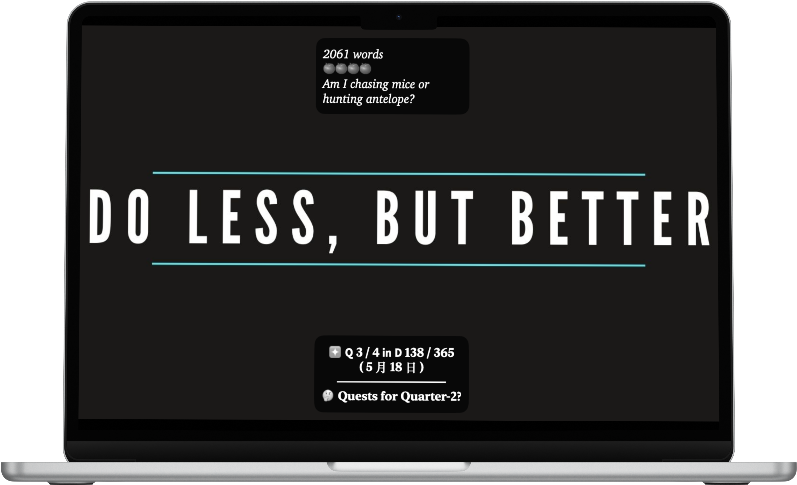
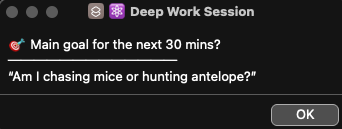
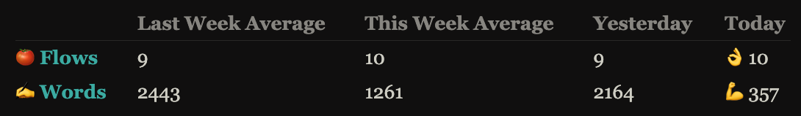

# Deep Work Machine

> Get. Shit. Done.

<a href="assets/mockup.png">
<kbd>

</kbd>
</a>

## Mantras

From Marty Fabrikant, as quoted in _The Knowledge_:

### 1. Talent Is Bullsh*t

> _“I’ve seen a million writers with talent. It means nothing. You need guts, you need stick-to-it-iveness. It’s work, you gotta work, do the freakin’ work. That’s why you’re gonna make it, son. You work. No one can take that away from you.”_

### 2. The Work Is Everything

> _“And I’ll tell you something else. Appreciate these days. These days when you’re broke and struggling, they’re the best days of your life. You’re gonna break through, my boy, and when you do, you’ll look back on this time and think this is when I was really an artist, when everything was pure and I had nothing but the dream and the work. Enjoy it now. Pay attention. These are the good days. Be grateful for them.”_

## About

> _“Productivity isn’t really about getting more things done, it’s mostly about learning to enjoy the journey — because when we’re having fun with things we’re doing, then productivity takes care of itself.” — Ali Abdaal_

[Deep Work Machine](https://huami.ng/deep-work-machine) is a personal productivity system that I use every single day. I track my progress and score myself using two metrics:

1. **Number of words written** — Based on the [`.obsidian/vault-stats.json`](https://github.com/huaminghuangtw/Second-Brain/blob/main/.obsidian/vault-stats.json) file generated by the [Better Word Count](https://github.com/lukeleppan/better-word-count) plugin in [Obsidian](https://obsidian.md/). This file aggregates the total word count across all notes, providing an accurate measure of my writing output—since all my writing is done in Obsidian.
2. **Number of [Pomodoro](https://en.wikipedia.org/wiki/Pomodoro_Technique) sessions completed** — Recorded by the [“Log Today’s Flow Counts”](https://shortcutomation.com/log-todays-flow-counts/)  Apple Shortcut, which logs each completed focus session ([“flow”](https://www.amazon.com/Flow-Psychology-Experience-Perennial-Classics/dp/0061339202)) to a plain text file.

Inspired by [Cal Newport’s book _Deep Work_](https://calnewport.com/deep-work-rules-for-focused-success-in-a-distracted-world/), I developed a structured routine that includes both a [boot-up](https://shortcutomation.com/boot-up-sequence/) and [shut-down sequence](https://shortcutomation.com/shut-down-sequence/). Each time I begin a deep work session, I launch the [“Deep Work Machine”](https://shortcutomation.com/deep-work-machine/), an  Apple Shortcut that automatically initiates my daily workflows—[opening my journal in Obsidian](https://shortcutomation.com/view-journal/), [reviewing today’s schedule in Calendar](https://shortcutomation.com/plan-my-day/), [confirming my task list in Reminders](https://shortcutomation.com/view-todays-tasks/), [etc.](https://shortcutomation.com/deep-work-session/) This process takes about 2–3 minutes and prepares my mind for deep work bouts.

> _“People with clear, written goals, accomplish far more in a shorter period of time than people without them could ever imagine.” — Brian Tracy_

Next, I write down my top goal for the next 30 minutes with [a thought-provoking question](https://huami.ng/journal-prompt/#productivity) to create mental clarity. Why? Because [what you work on is far more important than how productively you work](https://huami.ng/what-you-work-on-is-far-more-important-than-how-productively-you-work/). By deeply understanding my priorities, I can _refuse to_ feel rushed or in a hurry.

<table align="center">
	<tr>
	<td align="center">
		<a href="assets/alert.png">
		<kbd>
			
		</kbd>
		</a>
	</td>
	</tr>
	<tr>
	<td align="center">
		
		Before each deep work session, I do a micro-meditation: pause, close my eyes, and take a deep breath. Then I set an intention for the one thing I want to get done in the next 30 minutes, asking myself:
		<a href="https://simonsinek.com/books/start-with-why/">
		Why this task matters?
		</a>
		I always pick the most important task and stick to it for the entire block.
		Using
		<a href="https://github.com/huaminghuangtw/Evergreen-Lists?tab=readme-ov-file#how-i-built-this-project">
		checklists
		</a>
		helps a lot.
		
	</td>
	</tr>
</table>

Once ready, the shortcut plays [30 minutes of 40-Hz binaural beats](https://youtu.be/1_G60OdEzXs), a frequency that [has been shown in studies](https://youtu.be/CQlTmOFM4Qs?t=1h11m34s) to enhance working memory and cognitive performance.

While listening to the binaural beats, I often find myself entering the flow state, fully immersed in the present moment. **In that [“zone”](https://sketchplanations.com/one-buttock-playing), I experience “timeless time” and “effortless effort”—time goes by fast, and my best work emerges naturally.**

After each session, I take a 5–10 minute break to deliberately defocus and let my mind wander.

Since 2023, I’ve consistently trained myself to follow this **sprint-rest rhythm**. The alternation between periods of intense concentration and intentional relaxation has strengthened my “focus muscle” and dramatically extended my attention span while being [indistractable](https://www.nirandfar.com/indistractable/).

Each day, my goal is to complete at least 8 “intervals”,[^1] typically organized into 2–3 uninterrupted, laser-focused 90-minute sessions with 15–20 minute breaks in between. This approach aligns with [ultradian cycles](https://youtu.be/yb5zpo5WDG4?t=1575)—the natural rise and fall of alertness in 90-minute cycles.

<table align="center">
	<tr>
	<td align="center">
		<a href="assets/dashboard.png">
		<kbd>
			
		</kbd>
		</a>
	</td>
	</tr>
	<tr>
	<td align="center">
		
		A dashboard to visualize the two metrics, so I can compare with my past self.
		By gamifying the process, work becomes play and the world becomes a playground.
		This dashboard was built with
		<a href="https://github.com/blacksmithgu/obsidian-dataview">
		Dataview
		</a>
		in
		<a href="https://obsidian.md">
		Obsidian.
		</a>
		If you’re interested, check out the
		<a href="https://github.com/huaminghuangtw/Second-Brain/blob/main/Homepage.md">
		full code snippet
		</a>
		.
		
	</td>
	</tr>
</table>

> _“Happiness doesn’t always make us feel happy. Living up to our values, challenging ourselves, facing our mistakes, depriving ourselves… these aims make our lives happier, but they don’t always make us feel happy in the moment.” — Gretchen Rubin_

Discipline is the highest form of self-love. Practicing this discipline has been a rewarding journey, bringing a profound sense of purpose, satisfaction, and fulfillment to my creative work. [Cal Newport once said](https://calnewport.com/knowledge-workers-are-bad-at-working-and-heres-what-to-do-about-it/), “A working life dedicated to deep work is a working life well-lived.” **For me, a day devoted to deep work is a day well-invested.**

## Stats

<!-- STATS-START -->

|         | All Time | Monthly Average | Weekly Average | Daily Average |
| :-: | :-: | :-: | :-: | :-: |
| **Number of Flows** | 🍅 × 1630 ≈ 896 hours | 🍅 × 232 ≈ 128 hours | 🍅 × 53 ≈ 29 hours | 🍅 × 7.6 ≈ 4.2 hours |
| **Number of Words** | 349,141 words | 49,877 words | 11,519 words | 1,638 words |

<!-- STATS-END -->

<!-- LASTMONTH-START -->
### Latest Month (February 2026)

|  |  |
| :-: | :-: |
| Total Number of Flows = 246 | Total Number of Words = 38,912 |
| Daily Average = 9 | Daily Average = 1,390 |

<!-- LASTMONTH-END -->

### All Time

#### Number of Flows

<!-- INDEX-FLOWS-START -->

   <strong>
	  <a href="Number%20of%20Flows">All stats over 7 months</a>
   </strong>

* 

	

	  <strong>
		<a href="Number%20of%20Flows/2026">2026</a>
	  </strong>
	

	* 

	   

	   <a href="Number%20of%20Flows/2026/02-February">02-February</a>
	   

	   |  |
	   | :-: |
	   | Total = 246 |
	   | Daily Average = 9 |
	   

	* 

	   

	   <a href="Number%20of%20Flows/2026/01-January">01-January</a>
	   

	   |  |
	   | :-: |
	   | Total = 243 |
	   | Daily Average = 8 |
	   

  

* 

	

	  <strong>
		<a href="Number%20of%20Flows/2025">2025</a>
	  </strong>
	

	* 

	   

	   <a href="Number%20of%20Flows/2025/12-December">12-December</a>
	   

	   |  |
	   | :-: |
	   | Total = 267 |
	   | Daily Average = 9 |
	   

	* 

	   

	   <a href="Number%20of%20Flows/2025/11-November">11-November</a>
	   

	   |  |
	   | :-: |
	   | Total = 235 |
	   | Daily Average = 8 |
	   

	* 

	   

	   <a href="Number%20of%20Flows/2025/10-October">10-October</a>
	   

	   |  |
	   | :-: |
	   | Total = 273 |
	   | Daily Average = 9 |
	   

	* 

	   

	   <a href="Number%20of%20Flows/2025/09-September">09-September</a>
	   

	   |  |
	   | :-: |
	   | Total = 135 |
	   | Daily Average = 8 |
	   

	* 

	   

	   <a href="Number%20of%20Flows/2025/08-August">08-August</a>
	   

	   |  |
	   | :-: |
	   | Total = 231 |
	   | Daily Average = 7 |
	   

  

<!-- INDEX-FLOWS-END -->

#### Number of Words

<!-- INDEX-WORDS-START -->

   <strong>
	  <a href="Number%20of%20Words">All stats over 7 months</a>
   </strong>

* 

	

	  <strong>
		<a href="Number%20of%20Words/2026">2026</a>
	  </strong>
	

	* 

	   

	   <a href="Number%20of%20Words/2026/02-February">02-February</a>
	   

	   |  |
	   | :-: |
	   | Total = 38,912 |
	   | Daily Average = 1,390 |
	   

	* 

	   

	   <a href="Number%20of%20Words/2026/01-January">01-January</a>
	   

	   |  |
	   | :-: |
	   | Total = 53,610 |
	   | Daily Average = 1,729 |
	   

  

* 

	

	  <strong>
		<a href="Number%20of%20Words/2025">2025</a>
	  </strong>
	

	* 

	   

	   <a href="Number%20of%20Words/2025/12-December">12-December</a>
	   

	   |  |
	   | :-: |
	   | Total = 64,429 |
	   | Daily Average = 2,078 |
	   

	* 

	   

	   <a href="Number%20of%20Words/2025/11-November">11-November</a>
	   

	   |  |
	   | :-: |
	   | Total = 69,672 |
	   | Daily Average = 2,322 |
	   

	* 

	   

	   <a href="Number%20of%20Words/2025/10-October">10-October</a>
	   

	   |  |
	   | :-: |
	   | Total = 63,620 |
	   | Daily Average = 2,052 |
	   

	* 

	   

	   <a href="Number%20of%20Words/2025/09-September">09-September</a>
	   

	   |  |
	   | :-: |
	   | Total = 32,108 |
	   | Daily Average = 1,889 |
	   

	* 

	   

	   <a href="Number%20of%20Words/2025/08-August">08-August</a>
	   

	   |  |
	   | :-: |
	   | Total = 26,790 |
	   | Daily Average = 893 |
	   

  

<!-- INDEX-WORDS-END -->

## Support

You can view this project at [huami.ng/deep-work-machine](https://huami.ng/deep-work-machine) and all shortcuts related to this project on [Shortcutomation](https://shortcutomation.com/gallery/deep-work-machine). If you find this project valuable, please consider supporting my work by [buying me a coffee](https://buymeacoffee.com/huaming.huang).

[^1]: In their [1993 paper](https://psycnet.apa.org/record/1993-40718-001), Ericsson, Krampe, and Tesch-Römer noted that **“essentially no benefit [is gained] from durations exceeding 4 hr per day and reduced benefits from practice exceeding 2 hr … the effective duration of deliberate practice may be closer to 1 hr per day”** (p. 370), highlighting the cognitive and physiological limits on sustaining high-quality practice. More than two decades later, in his [2019 review](https://www.frontiersin.org/journals/psychology/articles/10.3389/fpsyg.2019.02396/full), Ericsson reaffirmed this principle, emphasizing that even among top performers across diverse fields, deliberate practice **typically peaks at 3–4 hours per day**, with additional effort beyond this threshold yielding diminishing or even negative returns unless balanced with adequate recovery.
